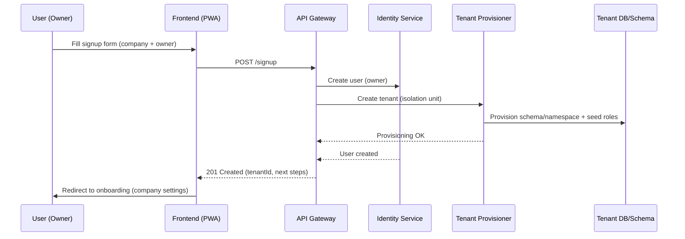
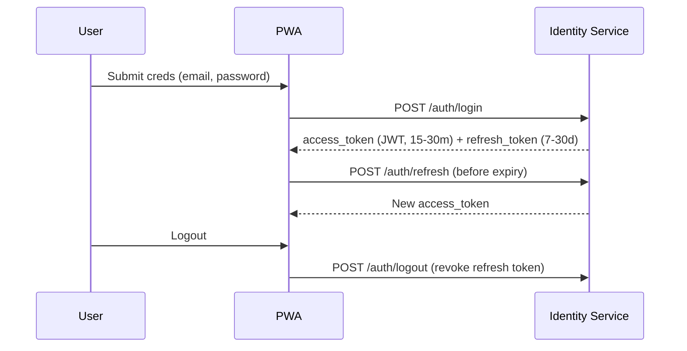
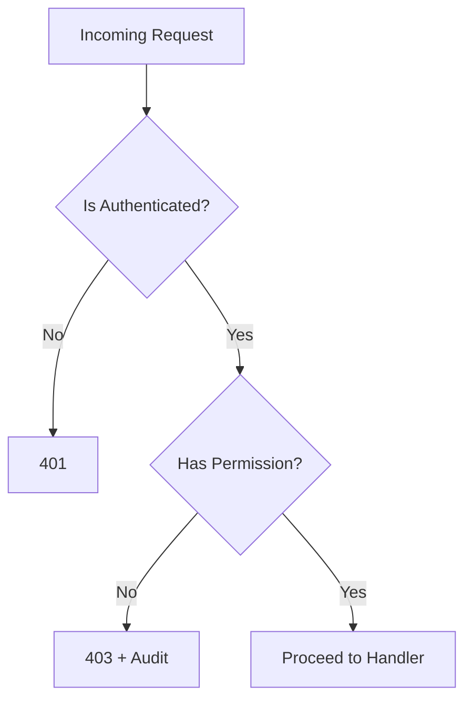
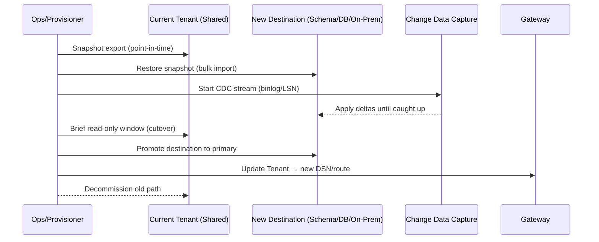

# ERP MVP – Platform & Authentication (Epic & Specs)

This document defines the scope, flows, user stories, acceptance criteria, API contracts, data model, and security requirements for **Signup, Authentication, Authorization (RBAC)**, **Tenant Provisioning**, and **User Management** for the ERP MVP targeting SME in manufacturing/retail/distribution.

---

## 1) Goals & Principles
- **Multi-tenant by default** with clear data isolation per tenant.
- **Mobile-first (PWA)**, token-based auth suitable for web & mobile clients.
- **Least privilege** via role-based access control (RBAC) + granular permissions.
- **Standards first**: OAuth2.1 flows, OIDC ID Token, JWT access tokens, refresh tokens.
- **Auditability**: all security-sensitive actions produce audit logs.

---

## 2) Core Epics & User Stories (JIRA style)

### Epic P1: Tenant Signup & Provisioning
- **US-P1.1** – As a **prospect owner**, I want to create a new company (tenant) so that I can start using the ERP.
  - **AC**: POST /signup creates **tenant** + **owner user** in one transaction.
- **US-P1.2** – As a **system admin**, I want automated provisioning (DB/schema, seed roles) so that new tenants are isolated and ready instantly.
  - **AC**: Background job or sync flow creates tenant resources within 60s.
- **US-P1.3** – As a **tenant owner**, I want company profile setup (name, tax info, currency, locale) so that reports reflect local settings.
  - **AC**: Settings persisted and used by finance/inventory modules.

### Epic P2: Authentication (Login, MFA, SSO later)
- **US-P2.1** – As a **user**, I want to sign in with email + password so that I can access my tenant.
  - **AC**: JWT access token (15–30m), refresh token (7–30d), secure cookie option.
- **US-P2.2** – As a **user**, I want password reset via email so that I can recover access.
  - **AC**: Time-bound signed link (15m), single-use.
- **US-P2.3** – As a **tenant admin**, I want optional **MFA** so that my company data is safer.
  - **AC**: TOTP (Authy/Google Authenticator); backup codes.
- **US-P2.4 (Future)** – As a **tenant admin**, I want **SSO** (Google/Microsoft) so users can login with corporate identity.
  - **AC**: OIDC with just-in-time user provisioning.

### Epic P3: Authorization & Roles (RBAC)
- **US-P3.1** – As a **tenant admin**, I want to assign roles to users so that access is controlled.
  - **AC**: Predefined roles + custom role creation with granular permissions.
- **US-P3.2** – As a **service**, I want permission checks on each request so that unauthorized operations are blocked.
  - **AC**: Central authz middleware; denies with 403 and audit trail.
- **US-P3.3** – As a **tenant admin**, I want role templates per module so that onboarding is fast (Finance, Sales, Inventory, Manufacturing).

### Epic P4: User Management
- **US-P4.1** – As a **tenant admin**, I want to invite users by email so that new staff can join quickly.
  - **AC**: Invite link, expires in 7 days; role preassignment; resend invite.
- **US-P4.2** – As a **tenant admin**, I want to deactivate users so that ex-staff lose access immediately.
  - **AC**: Immediate token revocation; audit entry.
- **US-P4.3** – As a **user**, I want to update my profile and change password so that my account stays current and secure.

### Epic P5: Security, Audit & Compliance
- **US-P5.1** – As a **security officer**, I want audit logs of logins, password resets, role changes, and key data exports so that I can investigate incidents.
- **US-P5.2** – As a **platform engineer**, I want rate limiting and IP throttling so that brute-force attacks are mitigated.
- **US-P5.3** – As a **tenant admin**, I want session management (view/kill active sessions) so that compromised tokens can be revoked.

---

## 3) High-Level Flows (Mermaid)

### 3.1 Tenant Signup & Provisioning

### 3.2 Authentication & Token Lifecycle

### 3.3 RBAC Check (Middleware)

---

## 4) API Design (Draft)

### 4.1 Auth & Session
- `POST /auth/login` → body: { email, password } → 200: { accessToken, refreshToken, expiresIn }
- `POST /auth/refresh` → body: { refreshToken } → 200: { accessToken, refreshToken }
- `POST /auth/logout` → body: { refreshToken } → 204
- `POST /auth/password/forgot` → body: { email } → 204
- `POST /auth/password/reset` → body: { token, newPassword } → 204
- `POST /auth/mfa/setup` (enable TOTP) → 200: { otpauthUrl, qrcode }
- `POST /auth/mfa/verify` → body: { code } → 204

### 4.2 Tenant & Provisioning
- `POST /signup` → body: { companyName, industry, owner: { name, email, password }, locale, currency } → 201: { tenantId }
- `GET /tenants/current` → 200: { tenantId, name, settings }
- `PATCH /tenants/current` → body: { name?, tax?, currency?, locale? } → 200

### 4.3 Users & Roles
- `POST /users/invite` → body: { email, roles: [] } → 201
- `POST /users/accept-invite` → body: { token, name, password } → 200
- `GET /users` → list users in tenant
- `PATCH /users/{id}` → activate/deactivate, change roles
- `GET /roles` → predefined + custom
- `POST /roles` → create custom role (only tenant admin)
- `PATCH /roles/{id}` → update permissions

### 4.4 Audit & Sessions
- `GET /audit` → filter by user, action, date
- `GET /sessions/me` → list active sessions
- `DELETE /sessions/{id}` → revoke session

---

## 5) Data Model (Logical) — **Decision & Hybrid Strategy**

### 5.0 Decision
- **MVP**: Use **Option A – Shared DB with `tenantId` column** for all business tables.
- **Scalability/Evolution**: Support **seamless migration** of selected tenants to:
  - **Option B1 – Schema-per-tenant** (same physical DB, separate schema/namespace), or
  - **Option B2 – DB-per-tenant** (dedicated database), or
  - **Option C – On‑Prem Tenant** (customer-managed infra).

> Principle: one **logical tenancy abstraction** in code; storage topology is an operational choice per tenant.

### 5.1 Core Entities (unchanged)
- **Tenant**(id, name, settings{currency, locale, taxProfile}, plan, region, deploymentMode[shared|schema|db|onprem], createdAt)
- **User**(id, email, passwordHash, name, status, createdAt)
- **UserTenant**(userId, tenantId, roles[], isPrimaryTenant)
- **Role**(id, tenantId|null, name, permissions[])
- **Invite**(id, tenantId, email, roles[], token, expiresAt, status)
- **AuthToken**(id, userId, tenantId, refreshTokenHash, createdAt, expiresAt, revokedAt)
- **AuditLog**(id, tenantId, userId, action, resource, payload, ip, ua, createdAt)

> All business tables carry `tenantId` (partition/sharding key) + compound indexes prefixed by `tenantId`.

### 5.2 Tenant Routing & Isolation
- **Tenant Resolver**: based on subdomain (e.g., `acme.app.com`) or request header `X-Tenant-Id`.
- **Connection Resolver**: lookup `Tenant.deploymentMode` → choose pool/DSN for shared/schema/db/onprem.
- **Row Isolation**: always apply `tenantId = :ctx.tenantId` at DAL layer; lint/enforce via query builder.
- **Encryption**: at-rest encryption + optional **per‑tenant data encryption key (TDEK)**; keys stored in KMS.
- **PII Masking**: field-level encryption or masking policies where relevant (e.g., customer phone, email).

### 5.3 Indexing & Partitioning (Option A)
- All hot-path queries begin with `tenantId` to leverage partition pruning.
- Standard compound indexes (examples):
  - `salesOrders(tenantId, status, createdAt)`
  - `inventoryMovements(tenantId, sku, createdAt)`
  - `journalEntries(tenantId, accountId, postedAt)`
- Large tables use **time-based partitioning** (monthly/quarterly) with `tenantId` as leading key.

### 5.4 Migration Path (A → B/C)

**Cutover Checklist**
- Pre-checks: storage size, index build, referential integrity, FK/constraints parity.
- Dual‑write (optional): enable for high‑risk tenants before hard cutover.
- Data validation: row counts per table, per‑tenant checksums, business invariant probes.
- Rollback: keep snapshot + CDC bookmark; gateway toggle back.

### 5.5 On‑Prem Tenants (Option C)
- **Packaging**: Helm charts / Docker Compose with Identity, API Gateway, Core Services, DB, Object Storage (e.g., MinIO), Message Bus.
- **Licensing**: signed license key bound to domain/instance; metering via usage beacon (opt‑in for air‑gapped).
- **Secrets**: customer-managed KMS; seed tenant owner on install.
- **Supportability**: telemetry exporters (optional), log shipping, backup policies defined in runbook.
- **Upgrade Path**: versioned migrations; preflight checks; blue‑green guidance.

### 5.6 Backups & DR (All Modes)
- **Shared/Schema/DB**: nightly full snapshot + 15‑min PITR logs; per‑tenant logical exports weekly.
- **On‑Prem**: provide backup CRON templates + integrity verification script (restore test).
- **Restore**: targeted tenant restore into sidecar DB, then route switch.

### 5.7 Data Residency & Regions
- `Tenant.region` controls storage locality (e.g., `ap-southeast-1`).
- File/report storage uses per‑tenant bucket/prefix; signed URL access.

### 5.8 Observability
- Per‑tenant metrics tags: qps, p95 latency, error rate, DB load.
- Noisy‑neighbor protection: connection pool quotas, query timeouts, rate limits per tenant.

---

## 6) RBAC Matrix (Initial)

| Module | Permission | Owner | Admin | Finance | Sales | Warehouse | Production |
|---|---|:--:|:--:|:--:|:--:|:--:|:--:|
| Tenant | manage_settings | ✓ | ✓ |  |  |  |  |
| Users  | invite_user | ✓ | ✓ |  |  |  |  |
| Users  | deactivate_user | ✓ | ✓ |  |  |  |  |
| Roles  | create_role | ✓ | ✓ |  |  |  |  |
| Finance| view_reports | ✓ | ✓ | ✓ |  |  |  |
| Finance| post_journal |  |  | ✓ |  |  |  |
| Sales  | create_order |  |  |  | ✓ |  |  |
| Sales  | sync_marketplace |  | ✓ |  | ✓ |  |  |
| Inventory | stock_in_out |  |  |  |  | ✓ |  |
| Inventory | transfer_stock |  |  |  |  | ✓ |  |
| Manufacturing | create_bom |  |  |  |  |  | ✓ |
| Manufacturing | create_wo |  |  |  |  |  | ✓ |

- Permissions are strings (e.g., `finance.post_journal`, `inventory.transfer_stock`).
- Roles map to permission sets; tenants may clone predefined roles to create custom ones.

---

## 7) Non-Functional & Security Requirements
- Password policy: min length, complexity, breach check (HIBP style hash range).
- Token security: signed JWT (RS256), short-lived access, long-lived refresh; rotate on each refresh.
- Storage: refresh tokens hashed (not plaintext); device binding optional.
- Rate limits: login (e.g., 5/min/IP), password reset requests (3/hour/email).
- CORS & CSRF: same-site cookies for web; bearer tokens for APIs.
- Secrets management: KMS/SSM/Vault; no secrets in code.
- Logging: structured logs; PII scrubbing.
- Backups: daily snapshots; tested restore.

---

## 8) Provisioning Design (MVP)
- **Provisioner service** handles: tenant record, role seeding, default settings, demo data (optional), storage buckets (for reporting templates).
- **Idempotent**: repeated calls safe.
- **Observability**: emit events (e.g., `tenant.provisioned`) for other services (finance/inventory) to react.

---

## 9) UX Notes (PWA)
- Single signup page (company + owner) → email verification → onboarding wizard (company settings, invite first users, connect marketplace).
- Clear tenant switcher (for users in multiple tenants).
- Security center page (MFA toggle, active sessions, backup codes).

---

## 10) Acceptance Test Scenarios (Samples)
1. **Signup success**: Given valid company & owner, when POST /signup, then tenant + owner exist, default roles created, and onboarding starts.
2. **Invite flow**: Given tenant admin invites a user, when invite accepted within 7 days, then user gains assigned roles and can login.
3. **RBAC enforcement**: Given a user without `inventory.transfer_stock`, when POST /inventory/transfer, then 403 and audit log recorded.
4. **Token refresh**: Given valid refresh token, when POST /auth/refresh, then new access token issued and old refresh token rotated.
5. **Password reset**: Given forgot password, when using expired token, then reset denied and new email can be requested (rate-limited).

---

## 11) Implementation Checklist
- [ ] Identity service (login, refresh, logout, forgot/reset, MFA).
- [ ] Tenant service (signup, settings, provisioning integration).
- [ ] RBAC middleware SDK for all services.
- [ ] User management UI (invite, roles, deactivate).
- [ ] Audit log service + viewer UI.
- [ ] Rate limiting + WAF rules.
- [ ] Telemetry: metrics for signup conversion, login success rate, invite acceptance.

---

## 12) Rollout Plan
- **Phase A (Internal Alpha)**: single region, shared DB model A; seed 1–2 test tenants.
- **Phase B (Pilot Tenants)**: enable MFA, add audit viewer; tighten rate limits; data export review.
- **Phase C (General Availability)**: optional SSO, session management UI, org-level API keys, tenant-level backups.

---

_End of document._

