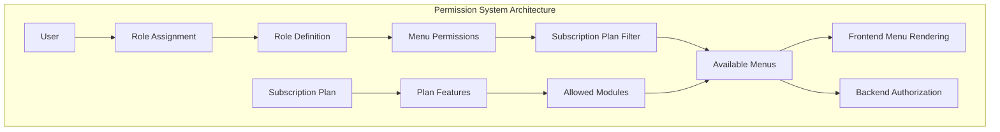

# Permission Management UI - Complete Implementation

## 1. System Architecture Overview



## 2. Database Schema Enhancement

### 2.1 Enhanced Tables for Permission Management

```sql
-- Enhanced roles table
CREATE TABLE roles (
    id UUID PRIMARY KEY DEFAULT gen_random_uuid(),
    tenant_id UUID NOT NULL REFERENCES tenants(id) ON DELETE CASCADE,
    name VARCHAR(50) NOT NULL,
    description TEXT,
    is_system BOOLEAN DEFAULT FALSE,
    created_at TIMESTAMP WITH TIME ZONE DEFAULT NOW(),
    updated_at TIMESTAMP WITH TIME ZONE DEFAULT NOW(),
    UNIQUE(tenant_id, name)
);

-- Menu/Module definitions
CREATE TABLE modules (
    id UUID PRIMARY KEY DEFAULT gen_random_uuid(),
    code VARCHAR(50) UNIQUE NOT NULL, -- e.g., 'master_data', 'sales', 'purchasing'
    name VARCHAR(100) NOT NULL,
    description TEXT,
    parent_id UUID REFERENCES modules(id),
    sort_order INTEGER DEFAULT 0,
    icon VARCHAR(50),
    is_active BOOLEAN DEFAULT TRUE,
    created_at TIMESTAMP WITH TIME ZONE DEFAULT NOW()
);

-- Menu items within modules
CREATE TABLE menu_items (
    id UUID PRIMARY KEY DEFAULT gen_random_uuid(),
    module_id UUID NOT NULL REFERENCES modules(id) ON DELETE CASCADE,
    code VARCHAR(50) NOT NULL, -- e.g., 'products', 'contacts', 'invoices'
    name VARCHAR(100) NOT NULL,
    description TEXT,
    route VARCHAR(200), -- Frontend route path
    permission_key VARCHAR(100) NOT NULL, -- e.g., 'products.view', 'sales.invoice'
    sort_order INTEGER DEFAULT 0,
    icon VARCHAR(50),
    is_active BOOLEAN DEFAULT TRUE,
    created_at TIMESTAMP WITH TIME ZONE DEFAULT NOW(),
    UNIQUE(module_id, code)
);

-- Subscription plans and their features
CREATE TABLE subscription_plans (
    id UUID PRIMARY KEY DEFAULT gen_random_uuid(),
    code VARCHAR(50) UNIQUE NOT NULL, -- 'basic', 'professional', 'enterprise'
    name VARCHAR(100) NOT NULL,
    description TEXT,
    price_monthly DECIMAL(10,2),
    price_yearly DECIMAL(10,2),
    is_active BOOLEAN DEFAULT TRUE,
    sort_order INTEGER DEFAULT 0,
    created_at TIMESTAMP WITH TIME ZONE DEFAULT NOW()
);

-- Plan features - what menu items are available per plan
CREATE TABLE plan_menu_items (
    id UUID PRIMARY KEY DEFAULT gen_random_uuid(),
    plan_id UUID NOT NULL REFERENCES subscription_plans(id) ON DELETE CASCADE,
    menu_item_id UUID NOT NULL REFERENCES menu_items(id) ON DELETE CASCADE,
    is_included BOOLEAN DEFAULT TRUE,
    created_at TIMESTAMP WITH TIME ZONE DEFAULT NOW(),
    UNIQUE(plan_id, menu_item_id)
);

-- Role permissions - what each role can access
CREATE TABLE role_permissions (
    id UUID PRIMARY KEY DEFAULT gen_random_uuid(),
    role_id UUID NOT NULL REFERENCES roles(id) ON DELETE CASCADE,
    menu_item_id UUID NOT NULL REFERENCES menu_items(id) ON DELETE CASCADE,
    can_view BOOLEAN DEFAULT FALSE,
    can_create BOOLEAN DEFAULT FALSE,
    can_edit BOOLEAN DEFAULT FALSE,
    can_delete BOOLEAN DEFAULT FALSE,
    can_export BOOLEAN DEFAULT FALSE,
    created_at TIMESTAMP WITH TIME ZONE DEFAULT NOW(),
    updated_at TIMESTAMP WITH TIME ZONE DEFAULT NOW(),
    UNIQUE(role_id, menu_item_id)
);

-- Update tenants table to include subscription plan
ALTER TABLE tenants ADD COLUMN subscription_plan_id UUID REFERENCES subscription_plans(id);

-- Indexes
CREATE INDEX idx_modules_parent_id ON modules(parent_id);
CREATE INDEX idx_menu_items_module_id ON menu_items(module_id);
CREATE INDEX idx_plan_menu_items_plan_id ON plan_menu_items(plan_id);
CREATE INDEX idx_role_permissions_role_id ON role_permissions(role_id);
CREATE INDEX idx_role_permissions_menu_item_id ON role_permissions(menu_item_id);
```

### 2.2 Seed Data

```sql
-- Insert subscription plans
INSERT INTO subscription_plans (code, name, description, price_monthly, price_yearly, sort_order) VALUES
('basic', 'Basic Plan', 'Essential features for small businesses', 29.00, 290.00, 1),
('professional', 'Professional Plan', 'Advanced features for growing businesses', 79.00, 790.00, 2),
('enterprise', 'Enterprise Plan', 'Full features for large organizations', 199.00, 1990.00, 3);

-- Insert modules
INSERT INTO modules (code, name, description, sort_order, icon) VALUES
('master_data', 'Master Data', 'Manage core business data', 1, 'database'),
('sales', 'Sales', 'Sales management and invoicing', 2, 'trending-up'),
('purchasing', 'Purchasing', 'Purchase orders and vendor management', 3, 'shopping-cart'),
('inventory', 'Inventory', 'Stock and warehouse management', 4, 'package'),
('finance', 'Finance', 'Accounting and financial reports', 5, 'dollar-sign'),
('manufacturing', 'Manufacturing', 'Production and BOM management', 6, 'settings'),
('reports', 'Reports', 'Business intelligence and analytics', 7, 'bar-chart');

-- Insert menu items
INSERT INTO menu_items (module_id, code, name, route, permission_key, sort_order, icon) VALUES
-- Master Data
((SELECT id FROM modules WHERE code = 'master_data'), 'products', 'Products', '/master-data/products', 'products.view', 1, 'box'),
((SELECT id FROM modules WHERE code = 'master_data'), 'contacts', 'Contacts', '/master-data/contacts', 'contacts.view', 2, 'users'),
((SELECT id FROM modules WHERE code = 'master_data'), 'categories', 'Categories', '/master-data/categories', 'categories.view', 3, 'tag'),

-- Sales
((SELECT id FROM modules WHERE code = 'sales'), 'invoices', 'Invoices', '/sales/invoices', 'sales.invoices.view', 1, 'file-text'),
((SELECT id FROM modules WHERE code = 'sales'), 'sales_orders', 'Sales Orders', '/sales/orders', 'sales.orders.view', 2, 'shopping-bag'),
((SELECT id FROM modules WHERE code = 'sales'), 'customers', 'Customers', '/sales/customers', 'sales.customers.view', 3, 'user-check'),

-- Purchasing
((SELECT id FROM modules WHERE code = 'purchasing'), 'purchase_orders', 'Purchase Orders', '/purchasing/orders', 'purchasing.orders.view', 1, 'clipboard-list'),
((SELECT id FROM modules WHERE code = 'purchasing'), 'purchase_invoices', 'Purchase Invoices', '/purchasing/invoices', 'purchasing.invoices.view', 2, 'receipt'),
((SELECT id FROM modules WHERE code = 'purchasing'), 'vendors', 'Vendors', '/purchasing/vendors', 'purchasing.vendors.view', 3, 'truck'),

-- Inventory
((SELECT id FROM modules WHERE code = 'inventory'), 'stock_levels', 'Stock Levels', '/inventory/stock', 'inventory.stock.view', 1, 'layers'),
((SELECT id FROM modules WHERE code = 'inventory'), 'warehouses', 'Warehouses', '/inventory/warehouses', 'inventory.warehouses.view', 2, 'home'),
((SELECT id FROM modules WHERE code = 'inventory'), 'stock_movements', 'Stock Movements', '/inventory/movements', 'inventory.movements.view', 3, 'activity'),

-- Finance
((SELECT id FROM modules WHERE code = 'finance'), 'chart_of_accounts', 'Chart of Accounts', '/finance/accounts', 'finance.accounts.view', 1, 'list'),
((SELECT id FROM modules WHERE code = 'finance'), 'journal_entries', 'Journal Entries', '/finance/journal', 'finance.journal.view', 2, 'book-open'),
((SELECT id FROM modules WHERE code = 'finance'), 'financial_reports', 'Financial Reports', '/finance/reports', 'finance.reports.view', 3, 'pie-chart'),

-- Manufacturing
((SELECT id FROM modules WHERE code = 'manufacturing'), 'bom', 'Bill of Materials', '/manufacturing/bom', 'manufacturing.bom.view', 1, 'git-branch'),
((SELECT id FROM modules WHERE code = 'manufacturing'), 'work_orders', 'Work Orders', '/manufacturing/work-orders', 'manufacturing.work_orders.view', 2, 'tool'),
((SELECT id FROM modules WHERE code = 'manufacturing'), 'production', 'Production', '/manufacturing/production', 'manufacturing.production.view', 3, 'cpu'),

-- Reports
((SELECT id FROM modules WHERE code = 'reports'), 'sales_reports', 'Sales Reports', '/reports/sales', 'reports.sales.view', 1, 'trending-up'),
((SELECT id FROM modules WHERE code = 'reports'), 'inventory_reports', 'Inventory Reports', '/reports/inventory', 'reports.inventory.view', 2, 'package'),
((SELECT id FROM modules WHERE code = 'reports'), 'financial_reports', 'Financial Reports', '/reports/financial', 'reports.financial.view', 3, 'dollar-sign');

-- Define plan features (Basic plan example)
INSERT INTO plan_menu_items (plan_id, menu_item_id, is_included) 
SELECT 
    (SELECT id FROM subscription_plans WHERE code = 'basic'),
    mi.id,
    CASE 
        WHEN mi.code IN ('products', 'contacts', 'invoices', 'purchase_orders') THEN TRUE
        ELSE FALSE
    END
FROM menu_items mi;

-- Professional plan gets more features
INSERT INTO plan_menu_items (plan_id, menu_item_id, is_included) 
SELECT 
    (SELECT id FROM subscription_plans WHERE code = 'professional'),
    mi.id,
    CASE 
        WHEN mi.code IN ('products', 'contacts', 'categories', 'invoices', 'sales_orders', 'customers', 
                        'purchase_orders', 'purchase_invoices', 'vendors', 'stock_levels', 'warehouses') THEN TRUE
        ELSE FALSE
    END
FROM menu_items mi;

-- Enterprise plan gets all features
INSERT INTO plan_menu_items (plan_id, menu_item_id, is_included) 
SELECT 
    (SELECT id FROM subscription_plans WHERE code = 'enterprise'),
    mi.id,
    TRUE
FROM menu_items mi;
```

## 3. Backend Models (SQLAlchemy)

### 3.1 Enhanced Models

```python
# models/permission.py
from sqlalchemy import Column, String, Boolean, Integer, Text, ForeignKey, DECIMAL, DateTime
from sqlalchemy.dialects.postgresql import UUID
from sqlalchemy.orm import relationship
from sqlalchemy.sql import func
import uuid
from config.database import Base

class Module(Base):
    __tablename__ = "modules"

    id = Column(UUID(as_uuid=True), primary_key=True, default=uuid.uuid4)
    code = Column(String(50), unique=True, nullable=False)
    name = Column(String(100), nullable=False)
    description = Column(Text)
    parent_id = Column(UUID(as_uuid=True), ForeignKey("modules.id"))
    sort_order = Column(Integer, default=0)
    icon = Column(String(50))
    is_active = Column(Boolean, default=True)
    created_at = Column(DateTime(timezone=True), server_default=func.now())

    # Relationships
    menu_items = relationship("MenuItem", back_populates="module")
    parent = relationship("Module", remote_side=[id])
    children = relationship("Module")

class MenuItem(Base):
    __tablename__ = "menu_items"

    id = Column(UUID(as_uuid=True), primary_key=True, default=uuid.uuid4)
    module_id = Column(UUID(as_uuid=True), ForeignKey("modules.id"), nullable=False)
    code = Column(String(50), nullable=False)
    name = Column(String(100), nullable=False)
    description = Column(Text)
    route = Column(String(200))
    permission_key = Column(String(100), nullable=False)
    sort_order = Column(Integer, default=0)
    icon = Column(String(50))
    is_active = Column(Boolean, default=True)
    created_at = Column(DateTime(timezone=True), server_default=func.now())

    # Relationships
    module = relationship("Module", back_populates="menu_items")
    plan_menu_items = relationship("PlanMenuItem", back_populates="menu_item")
    role_permissions = relationship("RolePermission", back_populates="menu_item")

class SubscriptionPlan(Base):
    __tablename__ = "subscription_plans"

    id = Column(UUID(as_uuid=True), primary_key=True, default=uuid.uuid4)
    code = Column(String(50), unique=True, nullable=False)
    name = Column(String(100), nullable=False)
    description = Column(Text)
    price_monthly = Column(DECIMAL(10, 2))
    price_yearly = Column(DECIMAL(10, 2))
    is_active = Column(Boolean, default=True)
    sort_order = Column(Integer, default=0)
    created_at = Column(DateTime(timezone=True), server_default=func.now())

    # Relationships
    plan_menu_items = relationship("PlanMenuItem", back_populates="plan")
    tenants = relationship("Tenant", back_populates="subscription_plan")

class PlanMenuItem(Base):
    __tablename__ = "plan_menu_items"

    id = Column(UUID(as_uuid=True), primary_key=True, default=uuid.uuid4)
    plan_id = Column(UUID(as_uuid=True), ForeignKey("subscription_plans.id"), nullable=False)
    menu_item_id = Column(UUID(as_uuid=True), ForeignKey("menu_items.id"), nullable=False)
    is_included = Column(Boolean, default=True)
    created_at = Column(DateTime(timezone=True), server_default=func.now())

    # Relationships
    plan = relationship("SubscriptionPlan", back_populates="plan_menu_items")
    menu_item = relationship("MenuItem", back_populates="plan_menu_items")

class RolePermission(Base):
    __tablename__ = "role_permissions"

    id = Column(UUID(as_uuid=True), primary_key=True, default=uuid.uuid4)
    role_id = Column(UUID(as_uuid=True), ForeignKey("roles.id"), nullable=False)
    menu_item_id = Column(UUID(as_uuid=True), ForeignKey("menu_items.id"), nullable=False)
    can_view = Column(Boolean, default=False)
    can_create = Column(Boolean, default=False)
    can_edit = Column(Boolean, default=False)
    can_delete = Column(Boolean, default=False)
    can_export = Column(Boolean, default=False)
    created_at = Column(DateTime(timezone=True), server_default=func.now())
    updated_at = Column(DateTime(timezone=True), onupdate=func.now())

    # Relationships
    role = relationship("Role", back_populates="permissions")
    menu_item = relationship("MenuItem", back_populates="role_permissions")

# Enhanced Role model
class Role(Base):
    __tablename__ = "roles"

    id = Column(UUID(as_uuid=True), primary_key=True, default=uuid.uuid4)
    tenant_id = Column(UUID(as_uuid=True), ForeignKey("tenants.id"), nullable=False)
    name = Column(String(50), nullable=False)
    description = Column(Text)
    is_system = Column(Boolean, default=False)
    created_at = Column(DateTime(timezone=True), server_default=func.now())
    updated_at = Column(DateTime(timezone=True), onupdate=func.now())

    # Relationships
    permissions = relationship("RolePermission", back_populates="role", cascade="all, delete-orphan")
    tenant = relationship("Tenant", back_populates="roles")

# Enhanced Tenant model
class Tenant(Base):
    __tablename__ = "tenants"

    # ... existing fields ...
    subscription_plan_id = Column(UUID(as_uuid=True), ForeignKey("subscription_plans.id"))
    
    # Relationships
    subscription_plan = relationship("SubscriptionPlan", back_populates="tenants")
    roles = relationship("Role", back_populates="tenant")
```

## 4. Backend API Implementation

### 4.1 Schemas

```python
# schemas/permission.py
from pydantic import BaseModel, Field
from typing import List, Optional, Dict, Any
from uuid import UUID
from datetime import datetime

class ModuleBase(BaseModel):
    code: str = Field(..., max_length=50)
    name: str = Field(..., max_length=100)
    description: Optional[str] = None
    icon: Optional[str] = None
    sort_order: int = 0

class Module(ModuleBase):
    id: UUID
    is_active: bool
    created_at: datetime
    
    class Config:
        orm_mode = True

class MenuItemBase(BaseModel):
    code: str = Field(..., max_length=50)
    name: str = Field(..., max_length=100)
    description: Optional[str] = None
    route: Optional[str] = None
    permission_key: str = Field(..., max_length=100)
    icon: Optional[str] = None
    sort_order: int = 0

class MenuItem(MenuItemBase):
    id: UUID
    module_id: UUID
    is_active: bool
    created_at: datetime
    
    class Config:
        orm_mode = True

class MenuItemWithModule(MenuItem):
    module: Module

class RolePermissionBase(BaseModel):
    can_view: bool = False
    can_create: bool = False
    can_edit: bool = False
    can_delete: bool = False
    can_export: bool = False

class RolePermission(RolePermissionBase):
    id: UUID
    role_id: UUID
    menu_item_id: UUID
    created_at: datetime
    updated_at: Optional[datetime]
    
    class Config:
        orm_mode = True

class RolePermissionWithMenuItem(RolePermission):
    menu_item: MenuItem

class RoleBase(BaseModel):
    name: str = Field(..., max_length=50)
    description: Optional[str] = None

class RoleCreate(RoleBase):
    permissions: List[Dict[str, Any]] = []  # [{"menu_item_id": "uuid", "can_view": true, ...}]

class RoleUpdate(BaseModel):
    name: Optional[str] = Field(None, max_length=50)
    description: Optional[str] = None
    permissions: Optional[List[Dict[str, Any]]] = None

class Role(RoleBase):
    id: UUID
    tenant_id: UUID
    is_system: bool
    created_at: datetime
    updated_at: Optional[datetime]
    
    class Config:
        orm_mode = True

class RoleWithPermissions(Role):
    permissions: List[RolePermissionWithMenuItem] = []

class AvailableMenusResponse(BaseModel):
    modules: List[Module] = []
    menu_items: List[MenuItemWithModule] = []
    current_plan: str
    plan_name: str

class SubscriptionPlan(BaseModel):
    id: UUID
    code: str
    name: str
    description: Optional[str]
    price_monthly: Optional[float]
    price_yearly: Optional[float]
    is_active: bool
    
    class Config:
        orm_mode = True
```

### 4.2 Permission Service

```python
# services/permission_service.py
from typing import List, Dict, Optional, Any
from uuid import UUID
from sqlalchemy.orm import Session, selectinload
from sqlalchemy import and_
from fastapi import HTTPException, status

from models.permission import (
    Module, MenuItem, Role, RolePermission, 
    SubscriptionPlan, PlanMenuItem
)
from models.tenant import Tenant
from schemas.permission import (
    RoleCreate, RoleUpdate, RoleWithPermissions,
    AvailableMenusResponse, ModuleBase, MenuItemWithModule
)
from services.audit_service import AuditService

class PermissionService:
    def __init__(self, db: Session, audit_service: AuditService):
        self.db = db
        self.audit_service = audit_service

    def get_available_menus_for_tenant(self, tenant_id: UUID) -> AvailableMenusResponse:
        """Get available menus based on tenant's subscription plan"""
        
        # Get tenant with subscription plan
        tenant = self.db.query(Tenant).options(
            selectinload(Tenant.subscription_plan)
        ).filter(Tenant.id == tenant_id).first()
        
        if not tenant:
            raise HTTPException(
                status_code=status.HTTP_404_NOT_FOUND,
                detail="Tenant not found"
            )
        
        if not tenant.subscription_plan:
            raise HTTPException(
                status_code=status.HTTP_400_BAD_REQUEST,
                detail="Tenant does not have a subscription plan"
            )
        
        # Get menu items available for this plan
        available_menu_items = self.db.query(MenuItem).join(
            PlanMenuItem, MenuItem.id == PlanMenuItem.menu_item_id
        ).filter(
            and_(
                PlanMenuItem.plan_id == tenant.subscription_plan.id,
                PlanMenuItem.is_included == True,
                MenuItem.is_active == True
            )
        ).options(
            selectinload(MenuItem.module)
        ).order_by(MenuItem.sort_order).all()
        
        # Get modules that have available menu items
        module_ids = list(set([item.module_id for item in available_menu_items]))
        modules = self.db.query(Module).filter(
            and_(
                Module.id.in_(module_ids),
                Module.is_active == True
            )
        ).order_by(Module.sort_order).all()
        
        return AvailableMenusResponse(
            modules=modules,
            menu_items=available_menu_items,
            current_plan=tenant.subscription_plan.code,
            plan_name=tenant.subscription_plan.name
        )

    def get_roles_for_tenant(self, tenant_id: UUID) -> List[RoleWithPermissions]:
        """Get all roles for a tenant with their permissions"""
        
        roles = self.db.query(Role).options(
            selectinload(Role.permissions).selectinload(RolePermission.menu_item).selectinload(MenuItem.module)
        ).filter(Role.tenant_id == tenant_id).order_by(Role.name).all()
        
        return [RoleWithPermissions.from_orm(role) for role in roles]

    def get_role_by_id(self, role_id: UUID, tenant_id: UUID) -> Optional[RoleWithPermissions]:
        """Get a specific role with permissions"""
        
        role = self.db.query(Role).options(
            selectinload(Role.permissions).selectinload(RolePermission.menu_item).selectinload(MenuItem.module)
        ).filter(
            and_(Role.id == role_id, Role.tenant_id == tenant_id)
        ).first()
        
        if not role:
            return None
            
        return RoleWithPermissions.from_orm(role)

    def create_role(self, tenant_id: UUID, role_data: RoleCreate, created_by: UUID) -> RoleWithPermissions:
        """Create a new role with permissions"""
        
        # Check if role name already exists
        existing_role = self.db.query(Role).filter(
            and_(Role.tenant_id == tenant_id, Role.name == role_data.name)
        ).first()
        
        if existing_role:
            raise HTTPException(
                status_code=status.HTTP_400_BAD_REQUEST,
                detail=f"Role '{role_data.name}' already exists"
            )
        
        # Validate menu items are available for tenant's plan
        available_menus = self.get_available_menus_for_tenant(tenant_id)
        available_menu_ids = [item.id for item in available_menus.menu_items]
        
        # Create role
        role = Role(
            tenant_id=tenant_id,
            name=role_data.name,
            description=role_data.description,
            is_system=False
        )
        self.db.add(role)
        self.db.flush()  # To get the role ID
        
        # Create permissions
        for perm_data in role_data.permissions:
            menu_item_id = UUID(perm_data["menu_item_id"])
            
            # Validate menu item is available for this tenant's plan
            if menu_item_id not in available_menu_ids:
                raise HTTPException(
                    status_code=status.HTTP_400_BAD_REQUEST,
                    detail=f"Menu item not available for your subscription plan"
                )
            
            permission = RolePermission(
                role_id=role.id,
                menu_item_id=menu_item_id,
                can_view=perm_data.get("can_view", False),
                can_create=perm_data.get("can_create", False),
                can_edit=perm_data.get("can_edit", False),
                can_delete=perm_data.get("can_delete", False),
                can_export=perm_data.get("can_export", False)
            )
            self.db.add(permission)
        
        self.db.commit()
        
        # Audit log
        self.audit_service.log_role_created(
            tenant_id=tenant_id,
            user_id=created_by,
            role_id=role.id,
            role_name=role.name
        )
        
        return self.get_role_by_id(role.id, tenant_id)

    def update_role(self, role_id: UUID, tenant_id: UUID, role_data: RoleUpdate, updated_by: UUID) -> RoleWithPermissions:
        """Update role and permissions"""
        
        role = self.db.query(Role).filter(
            and_(Role.id == role_id, Role.tenant_id == tenant_id)
        ).first()
        
        if not role:
            raise HTTPException(
                status_code=status.HTTP_404_NOT_FOUND,
                detail="Role not found"
            )
        
        if role.is_system:
            raise HTTPException(
                status_code=status.HTTP_400_BAD_REQUEST,
                detail="Cannot modify system roles"
            )
        
        # Update basic role info
        if role_data.name is not None:
            # Check name uniqueness
            existing_role = self.db.query(Role).filter(
                and_(
                    Role.tenant_id == tenant_id,
                    Role.name == role_data.name,
                    Role.id != role_id
                )
            ).first()
            
            if existing_role:
                raise HTTPException(
                    status_code=status.HTTP_400_BAD_REQUEST,
                    detail=f"Role '{role_data.name}' already exists"
                )
            
            role.name = role_data.name
        
        if role_data.description is not None:
            role.description = role_data.description
        
        # Update permissions if provided
        if role_data.permissions is not None:
            # Get available menus for validation
            available_menus = self.get_available_menus_for_tenant(tenant_id)
            available_menu_ids = [item.id for item in available_menus.menu_items]
            
            # Delete existing permissions
            self.db.query(RolePermission).filter(
                RolePermission.role_id == role_id
            ).delete()
            
            # Create new permissions
            for perm_data in role_data.permissions:
                menu_item_id = UUID(perm_data["menu_item_id"])
                
                # Validate menu item is available
                if menu_item_id not in available_menu_ids:
                    raise HTTPException(
                        status_code=status.HTTP_400_BAD_REQUEST,
                        detail=f"Menu item not available for your subscription plan"
                    )
                
                permission = RolePermission(
                    role_id=role_id,
                    menu_item_id=menu_item_id,
                    can_view=perm_data.get("can_view", False),
                    can_create=perm_data.get("can_create", False),
                    can_edit=perm_data.get("can_edit", False),
                    can_delete=perm_data.get("can_delete", False),
                    can_export=perm_data.get("can_export", False)
                )
                self.db.add(permission)
        
        self.db.commit()
        
        # Audit log
        self.audit_service.log_role_updated(
            tenant_id=tenant_id,
            user_id=updated_by,
            role_id=role_id,
            role_name=role.name
        )
        
        return self.get_role_by_id(role_id, tenant_id)

    def delete_role(self, role_id: UUID, tenant_id: UUID, deleted_by: UUID) -> bool:
        """Delete a role"""
        
        role = self.db.query(Role).filter(
            and_(Role.id == role_id, Role.tenant_id == tenant_id)
        ).first()
        
        if not role:
            raise HTTPException(
                status_code=status.HTTP_404_NOT_FOUND,
                detail="Role not found"
            )
        
        if role.is_system:
            raise HTTPException(
                status_code=status.HTTP_400_BAD_REQUEST,
                detail="Cannot delete system roles"
            )
        
        # Check if role is assigned to any users
        from models.user import UserTenant
        users_with_role = self.db.query(UserTenant).filter(
            UserTenant.roles.any(role.name)
        ).count()
        
        if users_with_role > 0:
            raise HTTPException(
                status_code=status.HTTP_400_BAD_REQUEST,
                detail=f"Cannot delete role. It is assigned to {users_with_role} user(s)"
            )
        
        role_name = role.name
        self.db.delete(role)
        self.db.commit()
        
        # Audit log
        self.audit_service.log_role_deleted(
            tenant_id=tenant_id,
            user_id=deleted_by,
            role_id=role_id,
            role_name=role_name
        )
        
        return True

    def get_subscription_plans(self) -> List[SubscriptionPlan]:
        """Get all active subscription plans"""
        plans = self.db.query(SubscriptionPlan).filter(
            SubscriptionPlan.is_active == True
        ).order_by(SubscriptionPlan.sort_order).all()
        
        return plans

    def get_user_permissions(self, user_id: UUID, tenant_id: UUID) -> Dict[str, Dict[str, bool]]:
        """Get effective permissions for a user based on their roles"""
        
        from models.user import UserTenant
        
        # Get user's roles in this tenant
        user_tenant = self.db.query(UserTenant).filter(
            and_(UserTenant.user_id == user_id, UserTenant.tenant_id == tenant_id)
        ).first()
        
        if not user_tenant or not user_tenant.roles:
            return {}
        
        # Get all permissions for user's roles
        permissions_query = self.db.query(RolePermission).join(
            Role, RolePermission.role_id == Role.id
        ).join(
            MenuItem, RolePermission.menu_item_id == MenuItem.id
        ).filter(
            and_(
                Role.tenant_id == tenant_id,
                Role.name.in_(user_tenant.roles)
            )
        )
        
        # Aggregate permissions (OR operation - if any role grants permission, user has it)
        user_permissions = {}
        for perm in permissions_query:
            key = perm.menu_item.permission_key
            
            if key not in user_permissions:
                user_permissions[key] = {
                    'can_view': False,
                    'can_create': False,
                    'can_edit': False,
                    'can_delete': False,
                    'can_export': False
                }
            
            # OR operation for permissions
            user_permissions[key]['can_view'] = user_permissions[key]['can_view'] or perm.can_view
            user_permissions[key]['can_create'] = user_permissions[key]['can_create'] or perm.can_create
            user_permissions[key]['can_edit'] = user_permissions[key]['can_edit'] or perm.can_edit
            user_permissions[key]['can_delete'] = user_permissions[key]['can_delete'] or perm.can_delete
            user_permissions[key]['can_export'] = user_permissions[key]['can_export'] or perm.can_export
        
        return user_permissions
```

### 4.3 API Endpoints

```python
# api/v1/permissions.py
from fastapi import APIRouter, Depends, HTTPException, status
from sqlalchemy.orm import Session
from typing import List
from uuid import UUID

from schemas.permission import (
    RoleCreate, RoleUpdate, RoleWithPermissions, 
    AvailableMenusResponse, SubscriptionPlan
)
from services.permission_service import PermissionService
from services.audit_service import AuditService
from core.dependencies import get_db, get_current_user, require_permission
from core.security import SecurityContext

router = APIRouter()

def get_permission_service(db: Session = Depends(get_db)) -> PermissionService:
    audit_service = AuditService(db)
    return PermissionService(db, audit_service)

@router.get("/available-menus", response_model=AvailableMenusResponse)
async def get_available_menus(
    current_user: SecurityContext = Depends(get_current_user),
    permission_service: PermissionService = Depends(get_permission_service)
):
    """Get available menus based on current tenant's subscription plan"""
    return permission_service.get_available_menus_for_tenant(current_user.tenant_id)

@router.get("/roles", response_model=List[RoleWithPermissions])
async def get_roles(
    current_user: SecurityContext = Depends(require_permission("roles.view")),
    permission_service: PermissionService = Depends(get_permission_service)
):
    """Get all roles for current tenant"""
    return permission_service.get_roles_for_tenant(current_user.tenant_id)

@router.get("/roles/{role_id}", response_model=RoleWithPermissions)
async def get_role(
    role_id: UUID,
    current_user: SecurityContext = Depends(require_permission("roles.view")),
    permission_service: PermissionService = Depends(get_permission_service)
):
    """Get specific role with permissions"""
    role = permission_service.get_role_by_id(role_id, current_user.tenant_id)
    if not role:
        raise HTTPException(
            status_code=status.HTTP_404_NOT_FOUND,
            detail="Role not found"
        )
    return role

@router.post("/roles", response_model=RoleWithPermissions)
async def create_role(
    role_data: RoleCreate,
    current_user: SecurityContext = Depends(require_permission("roles.create")),
    permission_service: PermissionService = Depends(get_permission_service)
):
    """Create a new role"""
    return permission_service.create_role(
        tenant_id=current_user.tenant_id,
        role_data=role_data,
        created_by=current_user.user_id
    )

@router.put("/roles/{role_id}", response_model=RoleWithPermissions)
async def update_role(
    role_id: UUID,
    role_data: RoleUpdate,
    current_user: SecurityContext = Depends(require_permission("roles.edit")),
    permission_service: PermissionService = Depends(get_permission_service)
):
    """Update role and permissions"""
    return permission_service.update_role(
        role_id=role_id,
        tenant_id=current_user.tenant_id,
        role_data=role_data,
        updated_by=current_user.user_id
    )

@router.delete("/roles/{role_id}")
async def delete_role(
    role_id: UUID,
    current_user: SecurityContext = Depends(require_permission("roles.delete")),
    permission_service: PermissionService = Depends(get_permission_service)
):
    """Delete a role"""
    success = permission_service.delete_role(
        role_id=role_id,
        tenant_id=current_user.tenant_id,
        deleted_by=current_user.user_id
    )
    return {"message": "Role deleted successfully"}

@router.get("/subscription-plans", response_model=List[SubscriptionPlan])
async def get_subscription_plans(
    current_user: SecurityContext = Depends(get_current_user),
    permission_service: PermissionService = Depends(get_permission_service)
):
    """Get all subscription plans"""
    return permission_service.get_subscription_plans()

@router.get("/user-permissions")
async def get_user_permissions(
    current_user: SecurityContext = Depends(get_current_user),
    permission_service: PermissionService = Depends(get_permission_service)
):
    """Get current user's effective permissions"""
    return permission_service.get_user_permissions(
        current_user.user_id, 
        current_user.tenant_id
    )
```

## 5. Frontend Implementation

### 5.1 Role Management Page

```javascript
// components/admin/RoleManagement.jsx
import React, { useState, useEffect } from 'react';
import { Plus, Edit, Trash2, Users, Settings } from 'lucide-react';
import { permissionService } from '../../services/permissionService';
import RoleForm from './RoleForm';
import DeleteConfirmModal from '../common/DeleteConfirmModal';

const RoleManagement = () => {
  const [roles, setRoles] = useState([]);
  const [availableMenus, setAvailableMenus] = useState(null);
  const [isLoading, setIsLoading] = useState(true);
  const [showForm, setShowForm] = useState(false);
  const [editingRole, setEditingRole] = useState(null);
  const [deletingRole, setDeletingRole] = useState(null);
  const [error, setError] = useState('');

  useEffect(() => {
    loadData();
  }, []);

  const loadData = async () => {
    try {
      setIsLoading(true);
      const [rolesData, menusData] = await Promise.all([
        permissionService.getRoles(),
        permissionService.getAvailableMenus()
      ]);
      
      setRoles(rolesData);
      setAvailableMenus(menusData);
    } catch (error) {
      setError('Failed to load roles and permissions');
      console.error('Error loading data:', error);
    } finally {
      setIsLoading(false);
    }
  };

  const handleCreateRole = () => {
    setEditingRole(null);
    setShowForm(true);
  };

  const handleEditRole = (role) => {
    setEditingRole(role);
    setShowForm(true);
  };

  const handleDeleteRole = (role) => {
    setDeletingRole(role);
  };

  const handleFormSubmit = async (roleData) => {
    try {
      if (editingRole) {
        await permissionService.updateRole(editingRole.id, roleData);
      } else {
        await permissionService.createRole(roleData);
      }
      
      setShowForm(false);
      setEditingRole(null);
      await loadData();
    } catch (error) {
      throw error; // Let form handle the error
    }
  };

  const handleConfirmDelete = async () => {
    try {
      await permissionService.deleteRole(deletingRole.id);
      setDeletingRole(null);
      await loadData();
    } catch (error) {
      setError(error.response?.data?.detail || 'Failed to delete role');
    }
  };

  const getPermissionSummary = (permissions) => {
    const total = permissions.length;
    const withView = permissions.filter(p => p.can_view).length;
    const withCreate = permissions.filter(p => p.can_create).length;
    const withEdit = permissions.filter(p => p.can_edit).length;
    const withDelete = permissions.filter(p => p.can_delete).length;
    
    return `${withView}/${total} menus • ${withCreate} create • ${withEdit} edit • ${withDelete} delete`;
  };

  if (isLoading) {
    return (
      <div className="flex items-center justify-center h-64">
        <div className="animate-spin rounded-full h-12 w-12 border-b-2 border-indigo-600"></div>
      </div>
    );
  }

  return (
    <div className="space-y-6">
      {/* Header */}
      <div className="flex justify-between items-center">
        <div>
          <h1 className="text-2xl font-bold text-gray-900">Role Management</h1>
          <p className="mt-1 text-sm text-gray-600">
            Manage user roles and permissions for your organization
          </p>
          {availableMenus && (
            <p className="mt-1 text-sm text-indigo-600">
              Current Plan: <span className="font-medium">{availableMenus.plan_name}</span>
              {' '}• {availableMenus.menu_items.length} menu items available
            </p>
          )}
        </div>
        
        <button
          onClick={handleCreateRole}
          className="inline-flex items-center px-4 py-2 border border-transparent rounded-md shadow-sm text-sm font-medium text-white bg-indigo-600 hover:bg-indigo-700 focus:outline-none focus:ring-2 focus:ring-offset-2 focus:ring-indigo-500"
        >
          <Plus className="h-4 w-4 mr-2" />
          Create Role
        </button>
      </div>

      {/* Error Message */}
      {error && (
        <div className="bg-red-50 border border-red-200 text-red-600 px-4 py-3 rounded-md">
          {error}
        </div>
      )}

      {/* Roles Grid */}
      <div className="grid grid-cols-1 md:grid-cols-2 lg:grid-cols-3 gap-6">
        {roles.map((role) => (
          <div key={role.id} className="bg-white rounded-lg border border-gray-200 p-6 hover:shadow-md transition-shadow">
            <div className="flex items-start justify-between">
              <div className="flex-1">
                <div className="flex items-center">
                  <Settings className="h-5 w-5 text-gray-400 mr-2" />
                  <h3 className="text-lg font-medium text-gray-900">{role.name}</h3>
                  {role.is_system && (
                    <span className="ml-2 inline-flex items-center px-2 py-0.5 rounded text-xs font-medium bg-blue-100 text-blue-800">
                      System
                    </span>
                  )}
                </div>
                
                {role.description && (
                  <p className="mt-1 text-sm text-gray-600">{role.description}</p>
                )}
                
                <div className="mt-3">
                  <p className="text-xs text-gray-500">
                    {getPermissionSummary(role.permissions)}
                  </p>
                </div>
              </div>
              
              <div className="flex space-x-2 ml-4">
                <button
                  onClick={() => handleEditRole(role)}
                  className="p-2 text-gray-400 hover:text-indigo-600 hover:bg-indigo-50 rounded-md transition-colors"
                  title="Edit role"
                >
                  <Edit className="h-4 w-4" />
                </button>
                
                {!role.is_system && (
                  <button
                    onClick={() => handleDeleteRole(role)}
                    className="p-2 text-gray-400 hover:text-red-600 hover:bg-red-50 rounded-md transition-colors"
                    title="Delete role"
                  >
                    <Trash2 className="h-4 w-4" />
                  </button>
                )}
              </div>
            </div>
            
            {/* Permission Preview */}
            <div className="mt-4">
              <div className="text-xs text-gray-500 mb-2">Key Permissions:</div>
              <div className="flex flex-wrap gap-1">
                {role.permissions
                  .filter(p => p.can_view)
                  .slice(0, 3)
                  .map(permission => (
                    <span 
                      key={permission.menu_item_id}
                      className="inline-flex items-center px-2 py-1 rounded text-xs font-medium bg-green-100 text-green-800"
                    >
                      {permission.menu_item.name}
                    </span>
                  ))
                }
                {role.permissions.filter(p => p.can_view).length > 3 && (
                  <span className="inline-flex items-center px-2 py-1 rounded text-xs font-medium bg-gray-100 text-gray-800">
                    +{role.permissions.filter(p => p.can_view).length - 3} more
                  </span>
                )}
              </div>
            </div>
          </div>
        ))}
        
        {roles.length === 0 && (
          <div className="col-span-full text-center py-12">
            <Settings className="mx-auto h-12 w-12 text-gray-300" />
            <h3 className="mt-2 text-sm font-medium text-gray-900">No roles</h3>
            <p className="mt-1 text-sm text-gray-500">
              Get started by creating your first role.
            </p>
          </div>
        )}
      </div>

      {/* Role Form Modal */}
      {showForm && (
        <RoleForm
          role={editingRole}
          availableMenus={availableMenus}
          onSubmit={handleFormSubmit}
          onCancel={() => {
            setShowForm(false);
            setEditingRole(null);
          }}
        />
      )}

      {/* Delete Confirmation Modal */}
      {deletingRole && (
        <DeleteConfirmModal
          title="Delete Role"
          message={`Are you sure you want to delete the role "${deletingRole.name}"? This action cannot be undone.`}
          onConfirm={handleConfirmDelete}
          onCancel={() => setDeletingRole(null)}
          isDeleting={false}
        />
      )}
    </div>
  );
};

export default RoleManagement;
```

### 5.2 Role Form Component

```javascript
// components/admin/RoleForm.jsx
import React, { useState, useEffect } from 'react';
import { X, ChevronDown, ChevronRight, Check } from 'lucide-react';

const RoleForm = ({ role, availableMenus, onSubmit, onCancel }) => {
  const [formData, setFormData] = useState({
    name: '',
    description: '',
    permissions: []
  });
  const [expandedModules, setExpandedModules] = useState(new Set());
  const [isSubmitting, setIsSubmitting] = useState(false);
  const [errors, setErrors] = useState({});

  useEffect(() => {
    if (role) {
      setFormData({
        name: role.name,
        description: role.description || '',
        permissions: role.permissions.map(p => ({
          menu_item_id: p.menu_item_id,
          can_view: p.can_view,
          can_create: p.can_create,
          can_edit: p.can_edit,
          can_delete: p.can_delete,
          can_export: p.can_export
        }))
      });
    } else {
      // Initialize with empty permissions for all available menu items
      setFormData({
        name: '',
        description: '',
        permissions: availableMenus?.menu_items.map(item => ({
          menu_item_id: item.id,
          can_view: false,
          can_create: false,
          can_edit: false,
          can_delete: false,
          can_export: false
        })) || []
      });
    }
    
    // Expand all modules by default
    if (availableMenus?.modules) {
      setExpandedModules(new Set(availableMenus.modules.map(m => m.id)));
    }
  }, [role, availableMenus]);

  const handleSubmit = async (e) => {
    e.preventDefault();
    
    if (!validateForm()) return;
    
    setIsSubmitting(true);
    
    try {
      await onSubmit({
        ...formData,
        permissions: formData.permissions.filter(p => 
          p.can_view || p.can_create || p.can_edit || p.can_delete || p.can_export
        )
      });
    } catch (error) {
      setErrors({ 
        general: error.response?.data?.detail || 'Failed to save role' 
      });
    } finally {
      setIsSubmitting(false);
    }
  };

  const validateForm = () => {
    const newErrors = {};
    
    if (!formData.name.trim()) {
      newErrors.name = 'Role name is required';
    }
    
    const hasAnyPermission = formData.permissions.some(p => 
      p.can_view || p.can_create || p.can_edit || p.can_delete || p.can_export
    );
    
    if (!hasAnyPermission) {
      newErrors.permissions = 'At least one permission must be granted';
    }
    
    setErrors(newErrors);
    return Object.keys(newErrors).length === 0;
  };

  const updatePermission = (menuItemId, permissionType, value) => {
    setFormData(prev => ({
      ...prev,
      permissions: prev.permissions.map(p => 
        p.menu_item_id === menuItemId 
          ? { 
              ...p, 
              [permissionType]: value,
              // Auto-enable view if any other permission is enabled
              can_view: permissionType !== 'can_view' && value ? true : (permissionType === 'can_view' ? value : p.can_view)
            }
          : p
      )
    }));
  };

  const toggleModule = (moduleId) => {
    setExpandedModules(prev => {
      const newSet = new Set(prev);
      if (newSet.has(moduleId)) {
        newSet.delete(moduleId);
      } else {
        newSet.add(moduleId);
      }
      return newSet;
    });
  };

  const setModulePermissions = (moduleId, permissionType, value) => {
    const moduleMenuItems = availableMenus.menu_items.filter(item => item.module_id === moduleId);
    
    setFormData(prev => ({
      ...prev,
      permissions: prev.permissions.map(p => {
        const isModuleItem = moduleMenuItems.some(item => item.id === p.menu_item_id);
        if (isModuleItem) {
          return {
            ...p,
            [permissionType]: value,
            // Auto-enable view if any other permission is enabled
            can_view: permissionType !== 'can_view' && value ? true : (permissionType === 'can_view' ? value : p.can_view)
          };
        }
        return p;
      })
    }));
  };

  const getPermissionState = (menuItemId) => {
    return formData.permissions.find(p => p.menu_item_id === menuItemId) || {
      can_view: false,
      can_create: false,
      can_edit: false,
      can_delete: false,
      can_export: false
    };
  };

  const getModulePermissionSummary = (moduleId) => {
    const moduleMenuItems = availableMenus.menu_items.filter(item => item.module_id === moduleId);
    const permissions = moduleMenuItems.map(item => getPermissionState(item.id));
    
    const totals = {
      can_view: permissions.filter(p => p.can_view).length,
      can_create: permissions.filter(p => p.can_create).length,
      can_edit: permissions.filter(p => p.can_edit).length,
      can_delete: permissions.filter(p => p.can_delete).length,
      can_export: permissions.filter(p => p.can_export).length
    };
    
    return { totals, total: moduleMenuItems.length };
  };

  if (!availableMenus) {
    return <div>Loading...</div>;
  }

  return (
    <div className="fixed inset-0 bg-gray-500 bg-opacity-75 flex items-center justify-center p-4 z-50">
      <div className="bg-white rounded-lg shadow-xl max-w-6xl w-full max-h-screen overflow-hidden flex flex-col">
        {/* Header */}
        <div className="flex items-center justify-between p-6 border-b border-gray-200">
          <h2 className="text-xl font-semibold text-gray-900">
            {role ? 'Edit Role' : 'Create New Role'}
          </h2>
          <button
            onClick={onCancel}
            className="text-gray-400 hover:text-gray-500"
          >
            <X className="h-6 w-6" />
          </button>
        </div>

        <form onSubmit={handleSubmit} className="flex flex-col h-full">
          <div className="flex-1 overflow-y-auto p-6 space-y-6">
            {/* General Information */}
            <div className="grid grid-cols-1 md:grid-cols-2 gap-6">
              <div>
                <label className="block text-sm font-medium text-gray-700 mb-2">
                  Role Name *
                </label>
                <input
                  type="text"
                  value={formData.name}
                  onChange={(e) => setFormData({...formData, name: e.target.value})}
                  className="w-full px-3 py-2 border border-gray-300 rounded-md focus:outline-none focus:ring-2 focus:ring-indigo-500 focus:border-indigo-500"
                  placeholder="Enter role name"
                />
                {errors.name && (
                  <p className="mt-1 text-sm text-red-600">{errors.name}</p>
                )}
              </div>

              <div>
                <label className="block text-sm font-medium text-gray-700 mb-2">
                  Description
                </label>
                <input
                  type="text"
                  value={formData.description}
                  onChange={(e) => setFormData({...formData, description: e.target.value})}
                  className="w-full px-3 py-2 border border-gray-300 rounded-md focus:outline-none focus:ring-2 focus:ring-indigo-500 focus:border-indigo-500"
                  placeholder="Enter role description"
                />
              </div>
            </div>

            {/* Error Messages */}
            {errors.general && (
              <div className="bg-red-50 border border-red-200 text-red-600 px-4 py-3 rounded-md">
                {errors.general}
              </div>
            )}
            
            {errors.permissions && (
              <div className="bg-red-50 border border-red-200 text-red-600 px-4 py-3 rounded-md">
                {errors.permissions}
              </div>
            )}

            {/* Permissions Section */}
            <div>
              <div className="flex items-center justify-between mb-4">
                <h3 className="text-lg font-medium text-gray-900">Permissions</h3>
                <div className="text-sm text-gray-500">
                  Available for plan: <span className="font-medium text-indigo-600">{availableMenus.plan_name}</span>
                </div>
              </div>

              <div className="space-y-4">
                {availableMenus.modules.map((module) => {
                  const moduleMenuItems = availableMenus.menu_items.filter(item => item.module_id === module.id);
                  const isExpanded = expandedModules.has(module.id);
                  const summary = getModulePermissionSummary(module.id);

                  return (
                    <div key={module.id} className="border border-gray-200 rounded-lg">
                      {/* Module Header */}
                      <div className="bg-gray-50 px-4 py-3 border-b border-gray-200">
                        <div className="flex items-center justify-between">
                          <button
                            type="button"
                            onClick={() => toggleModule(module.id)}
                            className="flex items-center text-left"
                          >
                            {isExpanded ? (
                              <ChevronDown className="h-4 w-4 text-gray-400 mr-2" />
                            ) : (
                              <ChevronRight className="h-4 w-4 text-gray-400 mr-2" />
                            )}
                            <span className="font-medium text-gray-900">{module.name}</span>
                            <span className="ml-2 text-sm text-gray-500">
                              ({moduleMenuItems.length} items)
                            </span>
                          </button>
                          
                          <div className="text-xs text-gray-500">
                            View: {summary.totals.can_view}/{summary.total} • 
                            Create: {summary.totals.can_create}/{summary.total} • 
                            Edit: {summary.totals.can_edit}/{summary.total} • 
                            Delete: {summary.totals.can_delete}/{summary.total}
                          </div>
                        </div>
                        
                        {/* Module-level Permission Controls */}
                        {isExpanded && (
                          <div className="flex items-center space-x-4 mt-3 pt-3 border-t border-gray-200">
                            <span className="text-sm font-medium text-gray-700">Set all:</span>
                            {['can_view', 'can_create', 'can_edit', 'can_delete', 'can_export'].map((permission) => (
                              <button
                                key={permission}
                                type="button"
                                onClick={() => setModulePermissions(module.id, permission, true)}
                                className="text-xs px-2 py-1 bg-indigo-100 text-indigo-700 rounded hover:bg-indigo-200 transition-colors"
                              >
                                {permission.replace('can_', '').charAt(0).toUpperCase() + permission.replace('can_', '').slice(1)}
                              </button>
                            ))}
                            <button
                              type="button"
                              onClick={() => {
                                ['can_view', 'can_create', 'can_edit', 'can_delete', 'can_export'].forEach(permission => {
                                  setModulePermissions(module.id, permission, false);
                                });
                              }}
                              className="text-xs px-2 py-1 bg-gray-100 text-gray-700 rounded hover:bg-gray-200 transition-colors"
                            >
                              Clear All
                            </button>
                          </div>
                        )}
                      </div>

                      {/* Module Items */}
                      {isExpanded && (
                        <div className="p-4">
                          <div className="space-y-3">
                            {moduleMenuItems.map((menuItem) => {
                              const permissions = getPermissionState(menuItem.id);
                              
                              return (
                                <div key={menuItem.id} className="flex items-center justify-between py-2">
                                  <div className="flex items-center">
                                    <span className="font-medium text-gray-900">{menuItem.name}</span>
                                    {menuItem.description && (
                                      <span className="ml-2 text-sm text-gray-500">- {menuItem.description}</span>
                                    )}
                                  </div>
                                  
                                  <div className="flex items-center space-x-4">
                                    {['can_view', 'can_create', 'can_edit', 'can_delete', 'can_export'].map((permissionType) => (
                                      <label key={permissionType} className="flex items-center">
                                        <input
                                          type="checkbox"
                                          checked={permissions[permissionType]}
                                          onChange={(e) => updatePermission(menuItem.id, permissionType, e.target.checked)}
                                          className="h-4 w-4 text-indigo-600 focus:ring-indigo-500 border-gray-300 rounded"
                                        />
                                        <span className="ml-2 text-sm text-gray-700 capitalize">
                                          {permissionType.replace('can_', '')}
                                        </span>
                                      </label>
                                    ))}
                                  </div>
                                </div>
                              );
                            })}
                          </div>
                        </div>
                      )}
                    </div>
                  );
                })}
              </div>
            </div>
          </div>

          {/* Footer */}
          <div className="flex items-center justify-end px-6 py-4 bg-gray-50 border-t border-gray-200 space-x-3">
            <button
              type="button"
              onClick={onCancel}
              className="px-4 py-2 text-sm font-medium text-gray-700 bg-white border border-gray-300 rounded-md hover:bg-gray-50 focus:outline-none focus:ring-2 focus:ring-offset-2 focus:ring-indigo-500"
            >
              Cancel
            </button>
            <button
              type="submit"
              disabled={isSubmitting}
              className="px-4 py-2 text-sm font-medium text-white bg-indigo-600 border border-transparent rounded-md hover:bg-indigo-700 focus:outline-none focus:ring-2 focus:ring-offset-2 focus:ring-indigo-500 disabled:opacity-50 disabled:cursor-not-allowed"
            >
              {isSubmitting ? 'Saving...' : (role ? 'Update Role' : 'Create Role')}
            </button>
          </div>
        </form>
      </div>
    </div>
  );
};

export default RoleForm;
```

### 5.3 Permission Service

```javascript
// services/permissionService.js
import apiClient from './apiClient';

class PermissionService {
  
  async getAvailableMenus() {
    const response = await apiClient.get('/api/v1/permissions/available-menus');
    return response.data;
  }
  
  async getRoles() {
    const response = await apiClient.get('/api/v1/permissions/roles');
    return response.data;
  }
  
  async getRole(roleId) {
    const response = await apiClient.get(`/api/v1/permissions/roles/${roleId}`);
    return response.data;
  }
  
  async createRole(roleData) {
    const response = await apiClient.post('/api/v1/permissions/roles', roleData);
    return response.data;
  }
  
  async updateRole(roleId, roleData) {
    const response = await apiClient.put(`/api/v1/permissions/roles/${roleId}`, roleData);
    return response.data;
  }
  
  async deleteRole(roleId) {
    const response = await apiClient.delete(`/api/v1/permissions/roles/${roleId}`);
    return response.data;
  }
  
  async getSubscriptionPlans() {
    const response = await apiClient.get('/api/v1/permissions/subscription-plans');
    return response.data;
  }
  
  async getUserPermissions() {
    const response = await apiClient.get('/api/v1/permissions/user-permissions');
    return response.data;
  }
}

export const permissionService = new PermissionService();
```

### 5.4 Permission Hook

```javascript
// hooks/usePermissions.js
import { useState, useEffect, useContext, createContext } from 'react';
import { permissionService } from '../services/permissionService';
import { authService } from '../services/authService';

const PermissionContext = createContext();

export const PermissionProvider = ({ children }) => {
  const [permissions, setPermissions] = useState({});
  const [availableMenus, setAvailableMenus] = useState(null);
  const [isLoading, setIsLoading] = useState(true);

  useEffect(() => {
    loadPermissions();
  }, []);

  const loadPermissions = async () => {
    try {
      if (!authService.isAuthenticated()) {
        setIsLoading(false);
        return;
      }

      const [userPermissions, menuData] = await Promise.all([
        permissionService.getUserPermissions(),
        permissionService.getAvailableMenus()
      ]);
      
      setPermissions(userPermissions);
      setAvailableMenus(menuData);
    } catch (error) {
      console.error('Failed to load permissions:', error);
    } finally {
      setIsLoading(false);
    }
  };

  const hasPermission = (permissionKey, action = 'can_view') => {
    return permissions[permissionKey]?.[action] || false;
  };

  const canView = (permissionKey) => hasPermission(permissionKey, 'can_view');
  const canCreate = (permissionKey) => hasPermission(permissionKey, 'can_create');
  const canEdit = (permissionKey) => hasPermission(permissionKey, 'can_edit');
  const canDelete = (permissionKey) => hasPermission(permissionKey, 'can_delete');
  const canExport = (permissionKey) => hasPermission(permissionKey, 'can_export');

  const getAvailableMenuItems = () => {
    if (!availableMenus) return [];
    
    return availableMenus.menu_items.filter(item => 
      hasPermission(item.permission_key, 'can_view')
    );
  };

  const value = {
    permissions,
    availableMenus,
    isLoading,
    hasPermission,
    canView,
    canCreate,
    canEdit,
    canDelete,
    canExport,
    getAvailableMenuItems,
    refresh: loadPermissions
  };

  return (
    <PermissionContext.Provider value={value}>
      {children}
    </PermissionContext.Provider>
  );
};

export const usePermissions = () => {
  const context = useContext(PermissionContext);
  if (!context) {
    throw new Error('usePermissions must be used within a PermissionProvider');
  }
  return context;
};

// Permission-based component wrapper
export const PermissionGate = ({ permission, action = 'can_view', children, fallback = null }) => {
  const { hasPermission } = usePermissions();
  
  if (hasPermission(permission, action)) {
    return children;
  }
  
  return fallback;
};
```

### 5.5 Dynamic Navigation Component

```javascript
// components/layout/Sidebar.jsx
import React from 'react';
import { Link, useLocation } from 'react-router-dom';
import { usePermissions } from '../../hooks/usePermissions';
import * as Icons from 'lucide-react';

const Sidebar = () => {
  const location = useLocation();
  const { availableMenus, getAvailableMenuItems, isLoading } = usePermissions();

  if (isLoading) {
    return (
      <div className="bg-gray-800 text-white w-64 min-h-screen p-4">
        <div className="animate-pulse space-y-4">
          <div className="h-4 bg-gray-700 rounded"></div>
          <div className="h-4 bg-gray-700 rounded w-3/4"></div>
          <div className="h-4 bg-gray-700 rounded w-1/2"></div>
        </div>
      </div>
    );
  }

  const availableMenuItems = getAvailableMenuItems();
  
  // Group menu items by module
  const menuByModule = availableMenuItems.reduce((acc, item) => {
    const module = availableMenus.modules.find(m => m.id === item.module_id);
    if (!module) return acc;
    
    if (!acc[module.id]) {
      acc[module.id] = {
        module,
        items: []
      };
    }
    
    acc[module.id].items.push(item);
    return acc;
  }, {});

  const getIcon = (iconName) => {
    const Icon = Icons[iconName] || Icons.Circle;
    return Icon;
  };

  const isActive = (route) => {
    return location.pathname === route || location.pathname.startsWith(route + '/');
  };

  return (
    <div className="bg-gray-800 text-white w-64 min-h-screen flex flex-col">
      {/* Logo/Brand */}
      <div className="p-4 border-b border-gray-700">
        <h1 className="text-xl font-bold">ERP System</h1>
        <p className="text-sm text-gray-300">
          Plan: {availableMenus?.plan_name}
        </p>
      </div>

      {/* Navigation */}
      <nav className="flex-1 p-4 space-y-2">
        {Object.values(menuByModule)
          .sort((a, b) => a.module.sort_order - b.module.sort_order)
          .map(({ module, items }) => {
            const ModuleIcon = getIcon(module.icon);
            
            return (
              <div key={module.id} className="space-y-2">
                {/* Module Header */}
                <div className="flex items-center px-3 py-2 text-sm font-medium text-gray-300">
                  <ModuleIcon className="h-4 w-4 mr-2" />
                  {module.name}
                </div>
                
                {/* Module Menu Items */}
                <div className="ml-6 space-y-1">
                  {items
                    .sort((a, b) => a.sort_order - b.sort_order)
                    .map((item) => {
                      const ItemIcon = getIcon(item.icon);
                      const active = isActive(item.route);
                      
                      return (
                        <Link
                          key={item.id}
                          to={item.route}
                          className={`
                            flex items-center px-3 py-2 text-sm rounded-md transition-colors
                            ${active 
                              ? 'bg-gray-900 text-white' 
                              : 'text-gray-300 hover:bg-gray-700 hover:text-white'
                            }
                          `}
                        >
                          <ItemIcon className="h-4 w-4 mr-3" />
                          {item.name}
                        </Link>
                      );
                    })
                  }
                </div>
              </div>
            );
          })
        }
        
        {availableMenuItems.length === 0 && (
          <div className="text-center py-8 text-gray-400">
            <p>No menu items available</p>
            <p className="text-sm mt-1">Contact administrator</p>
          </div>
        )}
      </nav>

      {/* User Info */}
      <div className="p-4 border-t border-gray-700">
        <div className="flex items-center space-x-3">
          <div className="h-8 w-8 bg-indigo-500 rounded-full flex items-center justify-center">
            <span className="text-sm font-medium">
              {authService.getCurrentUser()?.name?.charAt(0) || 'U'}
            </span>
          </div>
          <div>
            <p className="text-sm font-medium">{authService.getCurrentUser()?.name}</p>
            <p className="text-xs text-gray-400">{authService.getCurrentUser()?.email}</p>
          </div>
        </div>
      </div>
    </div>
  );
};

export default Sidebar;
```

## 6. Usage Examples

### 6.1 Using Permission Gates in Components

```javascript
// components/products/ProductList.jsx
import React from 'react';
import { PermissionGate, usePermissions } from '../../hooks/usePermissions';
import { Plus, Edit, Trash2, Download } from 'lucide-react';

const ProductList = () => {
  const { canCreate, canEdit, canDelete, canExport } = usePermissions();

  return (
    <div className="space-y-6">
      <div className="flex justify-between items-center">
        <h1 className="text-2xl font-bold">Products</h1>
        
        <div className="flex space-x-2">
          <PermissionGate permission="products.view" action="can_export">
            <button className="btn-secondary">
              <Download className="h-4 w-4 mr-2" />
              Export
            </button>
          </PermissionGate>
          
          <PermissionGate permission="products.view" action="can_create">
            <button className="btn-primary">
              <Plus className="h-4 w-4 mr-2" />
              Add Product
            </button>
          </PermissionGate>
        </div>
      </div>

      {/* Product Table */}
      <div className="bg-white shadow rounded-lg">
        <table className="min-w-full divide-y divide-gray-200">
          <thead className="bg-gray-50">
            <tr>
              <th className="px-6 py-3 text-left text-xs font-medium text-gray-500 uppercase">
                Product Name
              </th>
              <th className="px-6 py-3 text-left text-xs font-medium text-gray-500 uppercase">
                SKU
              </th>
              <th className="px-6 py-3 text-left text-xs font-medium text-gray-500 uppercase">
                Price
              </th>
              <th className="px-6 py-3 text-left text-xs font-medium text-gray-500 uppercase">
                Stock
              </th>
              <PermissionGate 
                permission="products.view" 
                action="can_edit"
                fallback={null}
              >
                <th className="px-6 py-3 text-right text-xs font-medium text-gray-500 uppercase">
                  Actions
                </th>
              </PermissionGate>
            </tr>
          </thead>
          <tbody className="bg-white divide-y divide-gray-200">
            {/* Product rows */}
            <tr>
              <td className="px-6 py-4 whitespace-nowrap">Sample Product</td>
              <td className="px-6 py-4 whitespace-nowrap">SKU001</td>
              <td className="px-6 py-4 whitespace-nowrap">$99.99</td>
              <td className="px-6 py-4 whitespace-nowrap">50</td>
              
              <PermissionGate 
                permission="products.view" 
                action="can_edit"
                fallback={<td></td>}
              >
                <td className="px-6 py-4 whitespace-nowrap text-right text-sm font-medium">
                  <div className="flex justify-end space-x-2">
                    {canEdit('products.view') && (
                      <button className="text-indigo-600 hover:text-indigo-900">
                        <Edit className="h-4 w-4" />
                      </button>
                    )}
                    
                    {canDelete('products.view') && (
                      <button className="text-red-600 hover:text-red-900">
                        <Trash2 className="h-4 w-4" />
                      </button>
                    )}
                  </div>
                </td>
              </PermissionGate>
            </tr>
          </tbody>
        </table>
      </div>
    </div>
  );
};
```

### 6.2 Route Protection

```javascript
// components/routing/ProtectedRoute.jsx
import React from 'react';
import { Navigate } from 'react-router-dom';
import { usePermissions } from '../../hooks/usePermissions';

const ProtectedRoute = ({ 
  children, 
  permission, 
  action = 'can_view',
  redirectTo = '/dashboard',
  fallback = null 
}) => {
  const { hasPermission, isLoading } = usePermissions();

  if (isLoading) {
    return (
      <div className="flex items-center justify-center h-64">
        <div className="animate-spin rounded-full h-12 w-12 border-b-2 border-indigo-600"></div>
      </div>
    );
  }

  if (!hasPermission(permission, action)) {
    if (fallback) {
      return fallback;
    }
    return <Navigate to={redirectTo} replace />;
  }

  return children;
};

// Usage in routing
const AppRoutes = () => {
  return (
    <Routes>
      <Route path="/dashboard" element={<Dashboard />} />
      
      <Route 
        path="/master-data/products" 
        element={
          <ProtectedRoute permission="products.view">
            <ProductList />
          </ProtectedRoute>
        } 
      />
      
      <Route 
        path="/sales/invoices" 
        element={
          <ProtectedRoute permission="sales.invoices.view">
            <InvoiceList />
          </ProtectedRoute>
        } 
      />
      
      <Route 
        path="/admin/roles" 
        element={
          <ProtectedRoute permission="roles.view">
            <RoleManagement />
          </ProtectedRoute>
        } 
      />
    </Routes>
  );
};
```

## 7. Testing

### 7.1 Permission Service Tests

```python
# tests/test_permission_service.py
import pytest
from unittest.mock import Mock
from uuid import UUID, uuid4

from services.permission_service import PermissionService
from models.permission import Role, MenuItem, Module, SubscriptionPlan
from schemas.permission import RoleCreate

@pytest.fixture
def mock_db():
    return Mock()

@pytest.fixture
def mock_audit_service():
    return Mock()

@pytest.fixture
def permission_service(mock_db, mock_audit_service):
    return PermissionService(mock_db, mock_audit_service)

def test_create_role_success(permission_service, mock_db):
    # Arrange
    tenant_id = uuid4()
    mock_db.query().filter().first.return_value = None  # No existing role
    
    # Mock available menus
    menu_item = MenuItem(id=uuid4(), permission_key="products.view")
    permission_service.get_available_menus_for_tenant = Mock(return_value=Mock(
        menu_items=[menu_item]
    ))
    
    role_data = RoleCreate(
        name="Test Role",
        description="Test description",
        permissions=[{
            "menu_item_id": str(menu_item.id),
            "can_view": True,
            "can_create": False
        }]
    )
    
    # Act
    result = permission_service.create_role(tenant_id, role_data, uuid4())
    
    # Assert
    mock_db.add.assert_called()
    mock_db.commit.assert_called()

def test_create_role_duplicate_name(permission_service, mock_db):
    # Arrange
    tenant_id = uuid4()
    existing_role = Role(name="Test Role")
    mock_db.query().filter().first.return_value = existing_role
    
    role_data = RoleCreate(name="Test Role")
    
    # Act & Assert
    with pytest.raises(HTTPException) as exc_info:
        permission_service.create_role(tenant_id, role_data, uuid4())
    
    assert exc_info.value.status_code == 400
    assert "already exists" in str(exc_info.value.detail)
```

Implementasi lengkap ini memberikan sistem permission management yang sangat fleksibel dengan:

1. **Dynamic Menu Rendering** berdasarkan subscription plan
2. **Granular Permissions** (view, create, edit, delete, export) per menu item
3. **User-friendly Interface** untuk mengatur roles dan permissions
4. **Real-time Permission Checking** di frontend
5. **Subscription-aware** filtering menu items
6. **Audit Trail** untuk semua perubahan permissions

Sistem ini mudah diperluas untuk menambah menu baru atau mengubah subscription plans tanpa mengubah kode core aplikasi.