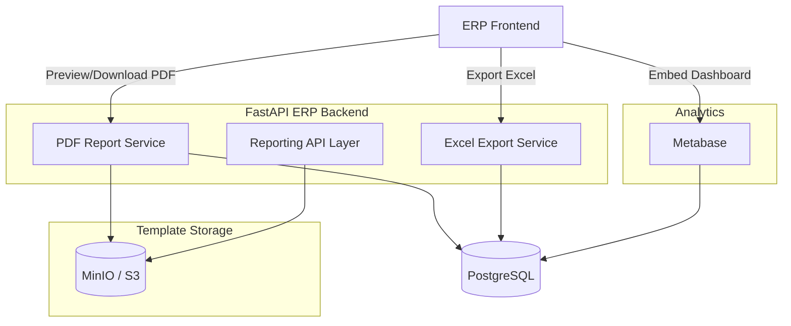
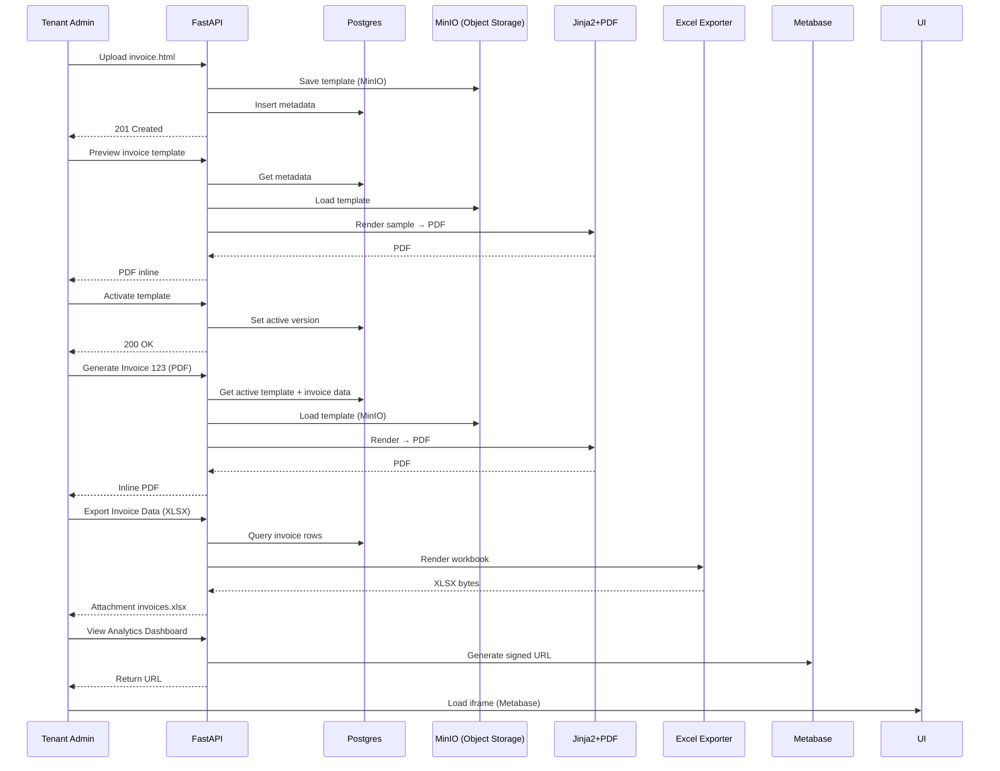

# RFC — ERP Reporting Service (Python/FastAPI)
**Scope:** Technical (HTML/Jinja2 PDF templates, Excel raw data export, Metabase analytics)  
**Version:** 1.2 (2025-09-08)  
**Author:** Architecture Team  
**Status:** Draft for review  

---

## 1) Ringkasan Eksekutif
Kita akan membangun **Reporting Service** untuk ERP berbasis **Python + FastAPI** dengan 3 pilar utama:
1. **PDF Reports** → Tenant upload HTML/Jinja2 template, render jadi PDF (invoice, receipt, PO).
2. **Excel Raw Data Exports** → Endpoint ekspor data transaksi mentah (sales, invoice, inventory) ke file Excel.
3. **Analytics Dashboards** → Integrasi dengan Metabase untuk visualisasi interaktif & BI.

**Mengapa kombinasi ini?**
- **PDF** untuk dokumen formal/legal.
- **Excel** untuk operasional & audit data mentah.
- **Metabase** untuk analisis tren & KPI interaktif.
- **MinIO** untuk penyimpanan template file (object storage, S3-compatible, bisa on-prem maupun cloud).

---

## 2) Goals & Non-Goals
**Goals**
- Mendukung multi-tenant reporting dengan isolasi.
- Template versioning & aktivasi (PDF reports).
- Excel export raw data per entity dengan query param (date range, filter).
- Embed Metabase dashboard ke ERP frontend dengan signed URL.
- Gunakan **MinIO** sebagai object storage untuk file template, dengan fallback LocalFS untuk development.

**Non-Goals**
- Tidak ada drag-n-drop editor (future work).
- Tidak ada scheduled report distribution (future work).

---

## 3) Arsitektur


---

## 4) Data Model
### reporting_templates (for PDF)
```sql
CREATE TABLE IF NOT EXISTS reporting_templates (
    id SERIAL PRIMARY KEY,
    tenant_id VARCHAR(50) NOT NULL,
    template_type VARCHAR(50) NOT NULL,   -- invoice, receipt, po
    version INT NOT NULL,
    file_path TEXT NOT NULL,
    is_active BOOLEAN DEFAULT FALSE,
    created_at TIMESTAMP DEFAULT NOW()
);
```

**Storage Path Convention**  
`templates/{tenantId}/{templateType}/v{version}/template.html`  
Disimpan di **MinIO** (atau S3 cloud provider). Untuk development bisa fallback ke LocalFS.

### Excel Export → Query Based
- Tidak perlu tabel khusus.
- Query builder berdasarkan entity (invoice, sales order, inventory).

### Metabase
- Tidak ada perubahan schema → Metabase konek read-only ke Postgres.

---

## 5) API Desain
### PDF Reports
- `POST /admin/templates/{type}/upload`
- `POST /admin/templates/{type}/preview`
- `POST /admin/templates/{type}/{version}/activate`
- `GET /admin/templates/{type}/history`
- `GET /reports/invoice/{invoiceId}` → PDF

### Excel Exports
- `GET /reports/{entity}/export?from=2025-09-01&to=2025-09-07&format=xlsx`
  - Response: `application/vnd.openxmlformats-officedocument.spreadsheetml.sheet`
  - Stream langsung → attachment

### Metabase Integration
- `GET /analytics/embed/{dashboard_id}` → return signed URL (JWT)
- ERP frontend load iframe Metabase dengan signed URL

---

## 6) Sequence Diagram


---

## 7) Step-by-Step Implementasi
### PDF Reporting
1. Setup DB tabel `reporting_templates`.
2. Implement storage adapter: `MinIOStorage` (default) + `LocalStorage` (dev).
3. Implement PDF converter (WeasyPrint default).
4. Implement ReportingService (Jinja2 → PDF).
5. Expose endpoints upload/preview/activate/generate.

### Excel Export
1. Tambah modul `excel_exporter.py` (pakai openpyxl/xlsxwriter).
2. Repository query untuk setiap entity (invoice, order, stock).
3. Endpoint `GET /reports/{entity}/export` → stream XLSX.
4. Tambahkan filter param (date range, status, dsb.).
5. Unit test: validasi header & jumlah row.

### Metabase Integration
1. Deploy Metabase (Docker).
2. Buat DB user readonly per tenant (atau schema isolation).
3. Simpan `METABASE_EMBED_KEY` di backend.
4. Endpoint `GET /analytics/embed/{dashboard_id}` → generate JWT signed URL.
5. Frontend → render iframe dengan URL.

---

## 8) Acceptance Criteria (MVP)
- Admin dapat upload/preview/activate template PDF per tenant.
- Template disimpan di **MinIO** dengan path convention.
- User dapat generate invoice (PDF inline di browser).
- User dapat export invoice/sales data ke Excel.
- Tenant dapat melihat Metabase dashboard embedded dalam ERP.
- Semua akses terisolasi per tenant.

---

## 9) Future Work
- Drag-and-drop template editor untuk non-technical users.
- Scheduler untuk distribusi otomatis (email/S3 drop).
- Query builder UI untuk Excel exports.
- Multi-instance Metabase scaling per tenant.

---

**End of RFC v1.2**

